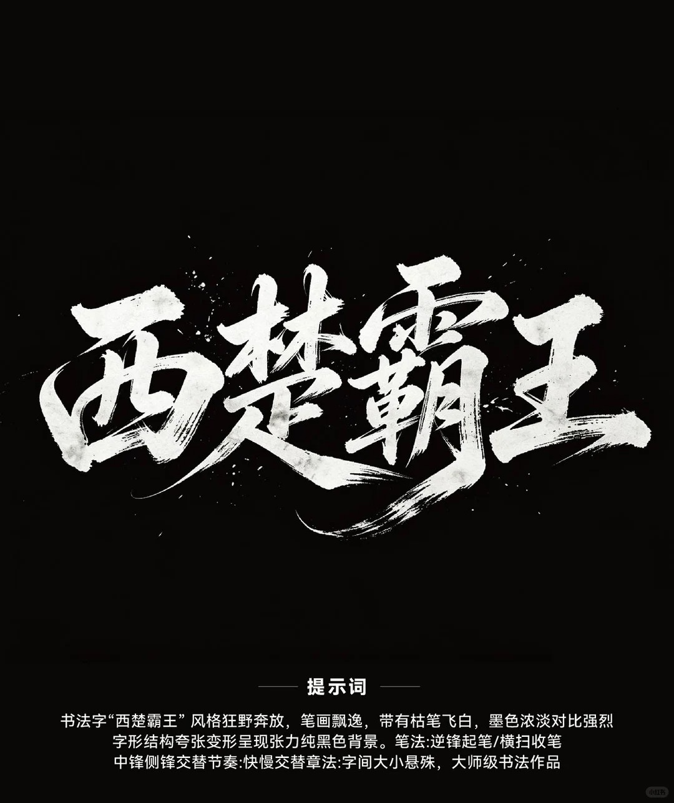
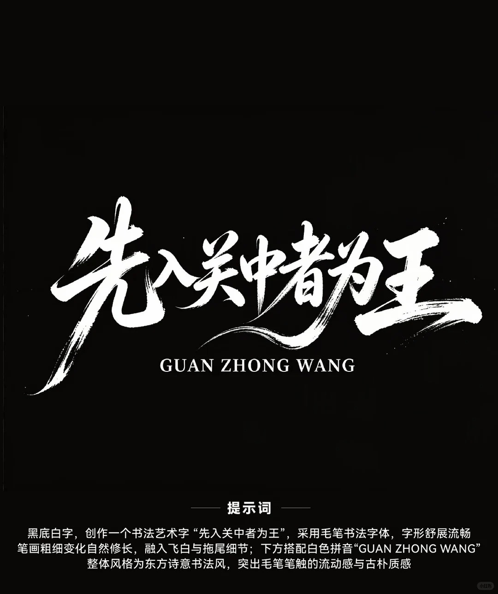
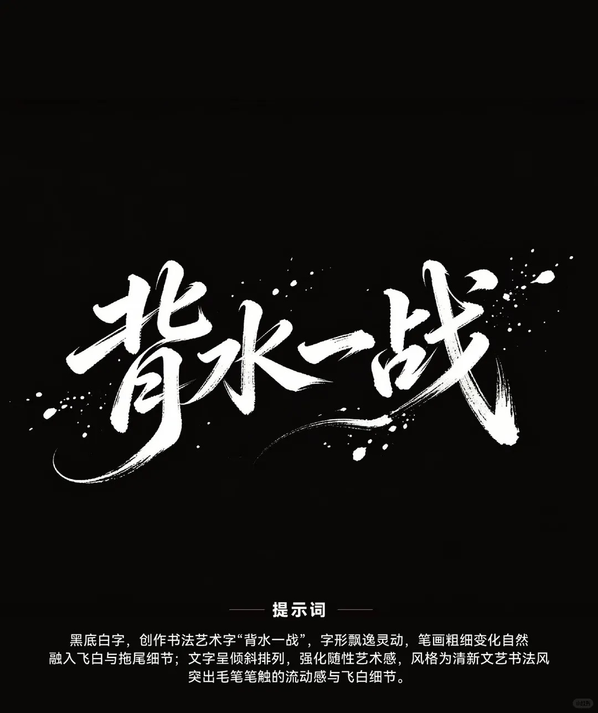
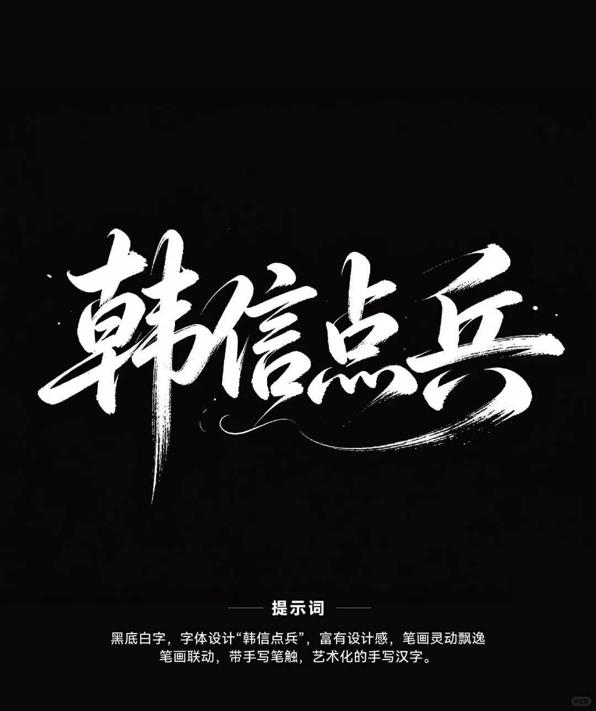
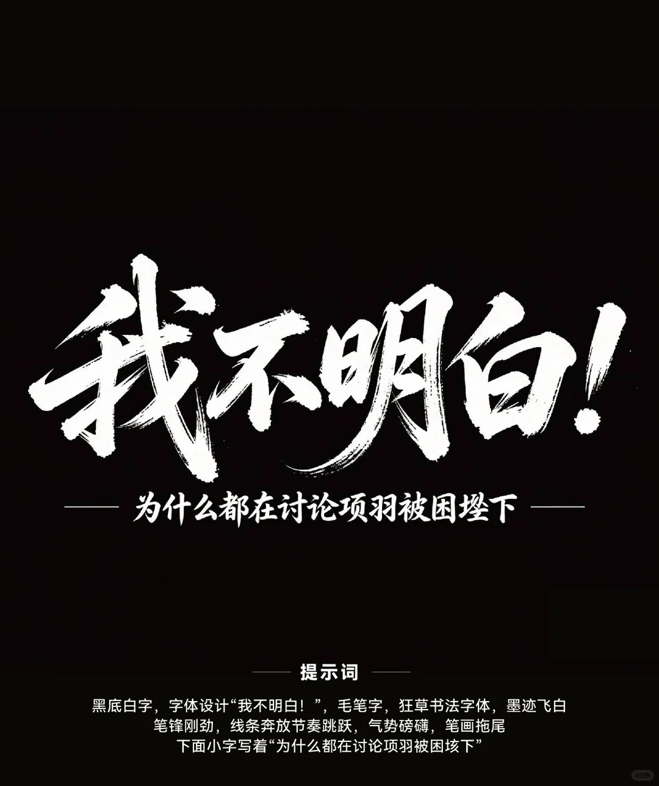

# 书法风格参考库（Calligraphy Style Reference Library）

本文档是 ppt-flair skill 中 **Stage A（标题字体概念）** 的核心决策参考。
每种风格配有视觉基准图、笔画特征描述、适用场景匹配、以及对应 AI 生图提示词关键词。

## 使用方式

当用户提供「标题文案 + 场合 + 情绪基调」后，AI 按以下决策链路自动推荐书风：

1. 解析标题文案语义（关键词提取）
2. 结合场合与情绪，在本文档的“匹配矩阵”中查找最优 3-4 种书风
3. 按推荐书风生成候选标题（3-4 种不同风格），用户挑选后进入后续阶段

---

## 风格一：狂野榜书（Wild Bangshu）



### 视觉特征
- **书风**：行楷榜书混合，结构夸张变形，墨色浓淡对比强烈
- **笔画**：枯笔飞白密集，逆锋起笔/横扫收笔，中锋侧锋交替
- **排版**：字间大小悬殊，节奏快慢交替，整体张狂有张力
- **情绪**：狂放、颠覆、霸气、破局

### 适用场景
| 场合 | 情绪词 | 匹配度 |
|------|--------|--------|
| 战略发布会 | 颠覆/破局/王者 | ★★★★★ |
| 年度大会主视觉 | 磅礴/登顶/霸气 | ★★★★★ |
| 新项目启动 | 开疆/破局/首战 | ★★★★☆ |
| 总经理汇报 | 沉稳/权威 | ★★☆☆☆（偏张狂，需用户确认） |

### 生图提示词关键词
> 巨型榜书大字，楷书为骨、行书连带，浓墨行楷榜书，结构夸张变形，枯笔飞白密集，墨色浓淡对比强烈，逆锋起笔横扫收笔，中锋侧锋交替，字间大小悬殊，节奏快慢交替，张狂有张力，纯黑背景，白色大字

> ⚠️ 书体硬锚点：**榜书、楷书为骨、行书连带**——与其他风格拉开差距的关键，不可省略。

---

## 风格二：东方诗意（Oriental Poetic）



### 视觉特征
- **书风**：毛笔书法字体，舒展流畅修长
- **笔画**：笔画粗细变化自然修长，融入飞白与拖尾细节
- **排版**：横排居中，下方可搭配白色拼音（高层汇报场景可去掉拼音）
- **情绪**：古朴、底蕴、诗意、传承

### 适用场景
| 场合 | 情绪词 | 匹配度 |
|------|--------|--------|
| 文化/品牌发布会 | 传承/底蕴/经典 | ★★★★★ |
| 内部表彰/总结 | 端正/温暖/人文 | ★★★★☆ |
| 总经理汇报 | 沉稳/底蕴 | ★★★★☆ |
| 战略发布会 | 突破/颠覆 | ★★☆☆☆（偏温和） |

### 生图提示词关键词
> 行楷书法，横势舒展开阔带隶书笔意，字形修长，笔画粗细变化自然，融入飞白与拖尾细节，古朴质感，东方诗意书法风，纯黑背景，白色大字

> ⚠️ 书体硬锚点：**行楷、隶书笔意**——与榜书（浓重狂放）和清新文艺（轻盈连带）区分的关键。

---

## 风格三：清新文艺（Fresh Art）



### 视觉特征
- **书风**：清新文艺书法风，飘逸灵动
- **笔画**：笔画粗细变化自然，飞白与拖尾细节，笔画间有连带
- **排版**：文字呈倾斜排列（5°-15°），强化随性艺术感
- **情绪**：轻盈、突破、创新、年轻化

### 适用场景
| 场合 | 情绪词 | 匹配度 |
|------|--------|--------|
| 创新/产品发布 | 突破/创新/新生代 | ★★★★★ |
| 年轻化品牌活动 | 活力/潮/新锐 | ★★★★★ |
| 总经理汇报 | 科技/未来 | ★★★★☆ |
| 年度大会 | 磅礴/沉稳 | ★★☆☆☆（偏轻，不够庄重） |

### 生图提示词关键词
> 行书，笔画连带流畅轻盈，字形飘逸灵动，笔画粗细变化自然，融入飞白与拖尾细节，文字呈倾斜排列，强化随性艺术感，毛笔笔触的流动感，纯黑背景，白色大字

> ⚠️ 书体硬锚点：**行书、连带流畅**——"轻、连、斜"三特征与榜书的"重、断、正"形成对比。

---

## 风格四：设计手写（Design Handwriting）



### 视觉特征
- **书风**：艺术化手写汉字，富有设计感
- **笔画**：笔画灵动飘逸，笔画联动（字与字间有笔触牵连），带手写笔触感
- **排版**：横排，字间距紧凑，整体有设计排版的节奏感
- **情绪**：灵动、敏捷、设计感、现代

### 适用场景
| 场合 | 情绪词 | 匹配度 |
|------|--------|--------|
| 设计/创意类汇报 | 设计/创意/灵感 | ★★★★★ |
| 敏捷/迭代类主题 | 敏捷/速度/灵动 | ★★★★★ |
| 科技/互联网主题 | 现代/前沿/酷 | ★★★★☆ |
| 年度大会 | 磅礴/庄重 | ★★☆☆☆（偏轻飘） |

### 生图提示词关键词
> 现代硬笔手写艺术字，笔画纤细均匀带设计感，笔画联动（字与字间有笔触牵连），钢笔笔触，艺术化的手写汉字，纯黑背景，白色大字

> ⚠️ 书体硬锚点：**硬笔手写体、钢笔笔触**——毛笔 vs 硬笔是与其他四种风格最根本的分野。

---

## 风格五：狂草奔放（Cursive Bold）



### 视觉特征
- **书风**：狂草书法字体，笔锋刚劲，线条奔放
- **笔画**：墨迹飞白，节奏跳跃，气势磅礴，笔画拖尾长
- **排版**：横排，字势向右上方倾斜，有强烈的动势
- **情绪**：激情、爆发力、极限、冲锋

### 适用场景
| 场合 | 情绪词 | 匹配度 |
|------|--------|--------|
| 冲刺/收官主题 | 冲刺/收官/决战 | ★★★★★ |
| 极限/挑战类主题 | 极限/突破/冲顶 | ★★★★★ |
| 战略发布会 | 颠覆/破局 | ★★★★☆ |
| 总经理汇报 | 沉稳/权威 | ★★☆☆☆（太张狂，需谨慎） |

### 生图提示词关键词
> 狂草书法字体，大草，字势连绵一笔数字，墨迹飞白，笔锋刚劲，线条奔放节奏跳跃，气势磅礴，笔画拖尾长，纯黑背景，白色大字

> ⚠️ 书体硬锚点：**狂草/大草、字势连绵**——连绵不断是草书与行书的本质区别。

---

## 自动选书风匹配矩阵

输入：`[标题文案]` + `[场合]` + `[情绪关键词]`

### 情绪 → 书风映射

| 情绪关键词 | 首选书风 | 次选书风 | 备选书风 |
|-----------|---------|---------|---------|
| 磅礴、登顶、霸气、王者 | 狂野榜书 | 狂草奔放 | 东方诗意 |
| 传承、底蕴、经典、人文 | 东方诗意 | 狂野榜书 | 清新文艺 |
| 突破、创新、新生代、新锐 | 清新文艺 | 设计手写 | 狂野榜书 |
| 设计、创意、灵感、灵动 | 设计手写 | 清新文艺 | 东方诗意 |
| 冲刺、决战、极限、爆发力 | 狂草奔放 | 狂野榜书 | 设计手写 |
| 沉稳、权威、庄重 | 东方诗意 | 狂野榜书 | 清新文艺 |
| 科技、未来、现代 | 清新文艺 | 设计手写 | 东方诗意 |
| 颠覆、破局、开疆 | 狂野榜书 | 狂草奔放 | 设计手写 |

### 场合 → 书风权重

| 场合 | 推荐书风组合（按优先级） |
|------|------------------------|
| 年度大会/总裁讲话 | 狂野榜书 → 东方诗意 → 狂草奔放 |
| 总经理汇报 | 东方诗意 → 狂野榜书 → 清新文艺 |
| 战略发布会 | 狂野榜书 → 狂草奔放 → 设计手写 |
| 产品/创新发布 | 清新文艺 → 设计手写 → 狂野榜书 |
| 文化/品牌活动 | 东方诗意 → 狂野榜书 → 清新文艺 |
| 收官/冲刺/表彰 | 狂草奔放 → 狂野榜书 → 东方诗意 |

### 标题字数适配

| 字数 | 推荐书风 | 原因 |
|------|---------|------|
| 2-4 字 | 全部适用 | 字少空间大，任何风格都能撑住 |
| 5-6 字 | 东方诗意、清新文艺、设计手写 | 狂野榜书和狂草奔放字多时易杂乱 |
| 7 字以上 | 东方诗意、设计手写 | 需要舒展流畅的笔画保持可读性 |

---

## 生图提示词完整模板（按风格）

每种风格的标准 AI 生图提示词结构：

```
[书体硬锚点 + 书风描述]，白色大字「标题文案」写在纯黑色背景上。
[笔画特征]，[排版特征]，字字清晰、字形准确，
横排居中构图，高对比，无其他文字无水印。
```

示例（狂野榜书 + "破局而立"）：
> 巨型榜书大字，楷书为骨、行书连带，白色大字「破局而立」写在纯黑色背景上。枯笔飞白密集，墨色浓淡对比强烈，逆锋起笔横扫收笔，中锋侧锋交替，字间大小悬殊，节奏快慢交替，张狂有张力，字字清晰、字形准确，横排居中构图，高对比，无其他文字无水印。

## 风格锚定方法（2026-08 实测教训）

**问题**：纯文字提示词对"书风气质"的区分度极低——三种不同风格提示词曾生成几乎一样的图（用户明确否决："三种风格的书法体差不多"）。

**解决方案（按优先级）**：

1. **书体硬锚点（必用）**：提示词首位写明具体书体——榜书/楷书/行书/隶书/草书/硬笔手写体。抽象气质词（"飘逸""灵动""诗意"）只能作辅助，不能当主锚点。
   - 五风格的差异化锚点速查：榜书=**重墨夸张**；东方诗意=**行楷+隶意、端正舒展**；清新文艺=**行书连带、轻盈倾斜**；设计手写=**硬笔钢笔触**；狂草=**大草连绵**。
2. **图生图参考（风格仍难区分时必用）**：把 `assets/calligraphy-ref/` 对应风格的基准图作为 image-to-image 输入，指令写"用图中这种笔触风格和字体气质，在纯黑色背景上用白色大字书写：『标题文案』，字字清晰、字形准确，横排居中"。参考图的笔触气质比文字描述可靠得多。
3. **生成后自检（硬关卡）**：候选中至少 2 种书风必须粗看可辨（笔画粗细、连带程度、字势正斜任一维度明显不同）。两两雷同即重生成——换书体锚点或换参考图，直到拉开差距。

---

*本库基于用户收集的 7 张书法字体参考图整理（小红书来源），每种风格配有视觉基准图供 AI 和对齐使用。*
